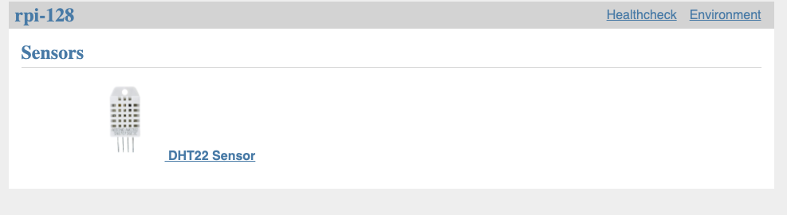

# coopernetes

Coopernetes chicken coop monitoring system. There are applications that run
on Pi Zeros for sensors and an array of RP4s for monitoring and alarms. This
picture shows what the sensors web server looks like with one DHT22:

The [sensor directory](sensors/) contains code that runs on the
Pis for collecting data and putting into a format so it can be gatered
by Prometheus.

The [ansible directory](ansible/) contains Ansible code to
install all the necessary code to get sensors and Kubernetes running.
