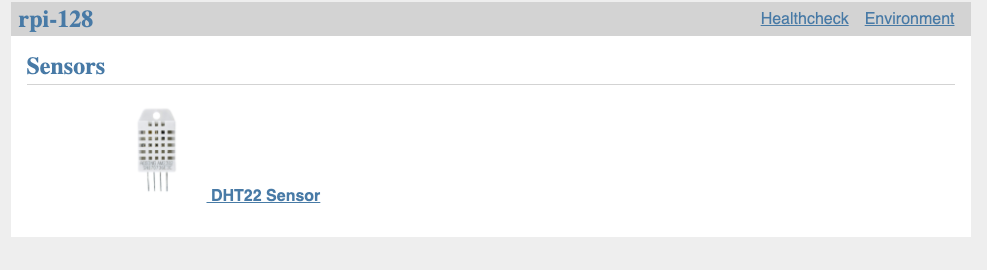

# Coopernetes Sensors

Coopernetes sensor code is written in Python because libraries for
the sensor device drivers is often available in Python. Flask is used
to create a web server and Prometheus client is used to gather the data.
The sensor code is loaded dynmaically depending on the configuration file.
Each sensor library derived from the BaseSensor class. See the
`sample_config.yaml` for an example of the configuration with the
example sensor. You can override the sample configuration by creating
a `config.yaml` in this directory.

This picture shows what the sensors web server looks like with one DHT22
temperature sensor:

A metrics page is added to the Flask web server for the Prometheus client
that makes the sensor data available for Prometheus to scrape. The data
for a temperature sensor looks like:

    # HELP rpi128_dht22_18_temperature Temperature
    # TYPE rpi128_dht22_18_temperature gauge
    rpi128_dht22_18_temperature 24.4
    # HELP rpi128_dht22_18_humidity Humidity Percent
    # TYPE rpi128_dht22_18_humidity gauge
    rpi128_dht22_18_humidity 63.1

The metrics names are made up of host name, sensor type, optionally GPIO
pin and metric identifier. In this example, the host is rpi128, sensor
is dht22, GPIO pin 18, and metric is temperature and humidity.
